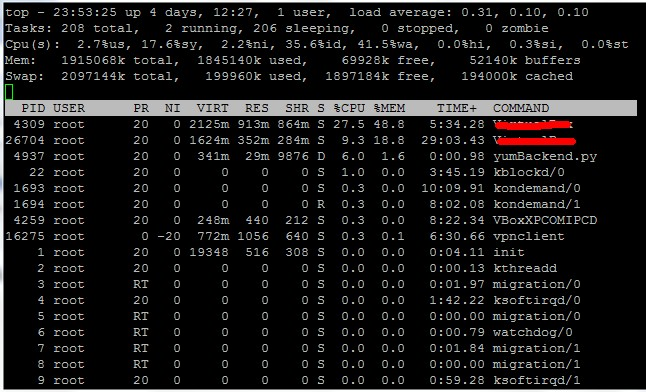
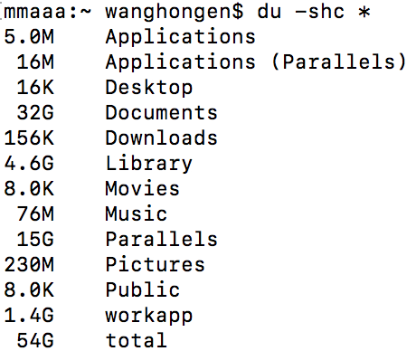
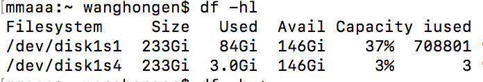

1. top 实时查看系统资源使用情况

   - 第一行 任务队列 当前时间，系统运行时间，登陆用户，平均负载
   - 第二行 进程信息
   - 第三行 cpu 利用情况
   - 最后两行内存信息
   - 各个进程的详细信息
   
2. du 对文件或目录磁盘使用空间的查看

   - a 显示目录中文件大小，递归
   - h 友好显示文件大小
   - c 显示所有文件大小和
   
3. df 通过文件系统快速, 硬盘被使用多少空间，还剩多少空间
 
   - l 仅显示本地端文件系统
