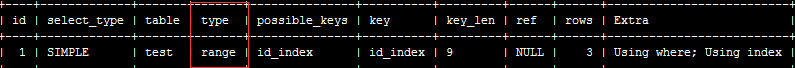
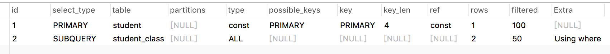
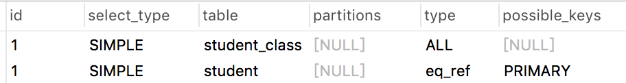
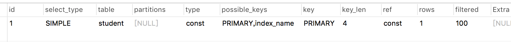

### mysql - explain 字段详解
现在建立3张表，1、student  2、 calss  3 student_class 建表语句如下
```mysql
CREATE TABLE `student` (
  `id` int(11) NOT NULL COMMENT 'id',
  `name` varchar(255) DEFAULT NULL,
  `age` int(11) DEFAULT NULL,
  PRIMARY KEY (`id`)
) ENGINE=InnoDB DEFAULT CHARSET=utf8mb4 COLLATE=utf8mb4_0900_ai_ci;
CREATE TABLE `class` (
  `id` int(11) NOT NULL,
  `name` varchar(255) DEFAULT NULL,
  PRIMARY KEY (`id`)
) ENGINE=InnoDB DEFAULT CHARSET=utf8mb4 COLLATE=utf8mb4_0900_ai_ci;
CREATE TABLE `student_class` (
  `id` int(11) NOT NULL,
  `student_id` int(11) NOT NULL,
  `class_id` int(11) NOT NULL,
  PRIMARY KEY (`id`)
) ENGINE=InnoDB DEFAULT CHARSET=utf8mb4 COLLATE=utf8mb4_0900_ai_ci;

```


1. id 表示select查询的顺序组号，越大优先级越高，越先被执行， 如查询1：查出一般的任何一个同学
    ```mysql
    select student.name from student where id = (select student_id from student_class where class_id = 1 LIMIT 1);
    ```
    
    上图显示有两个组，先执行子查询，在执行外面的查询
    id如果相同，可以认为是一组，从上往下顺序执行；
2. select_type 
   - SIMPLE 查询中不包含子查询和union
   - PRIMARY， SUBQUERY 包含子查询，外面的为PRIMARY，里面的为SUBQUERY，如查询1所示结果
   - DERIVED 派生表的select，from子句的自查询
3. table 
   - 查的是那张表
4. type  mysql在表中找所需行的方式
   - ALL 遍历全表找到行  从硬盘读取数据，索引中没有那一列
   
      ```mysql
      EXPLAIN select * from student;
      ```
   - index 扫描全部部索引树
     ```mysql
       EXPLAIN select id from student;
     ```
     
   - range 使用索引检测指定范围行  range > <
     ```mysql
      EXPLAIN select * from student WHERE id BETWEEN 1 and 2;
     ```
   - ref 非唯一性索引扫描，返回匹配某个单独值的所有行。 name 为非唯一索引
     ```mysql
      EXPLAIN select * from student WHERE name = 'whe'
     ```
   - eq_ref：唯一性索引扫描，对于每个索引键，表中只有一条记录与之匹配。常见于主键 或 唯一索引扫描。
     
     ```mysql
      EXPLAIN select student.name, student_class.class_id from student, student_class where student.id = student_class.student_id
     ```
   - const 表示通过索引一次就找到了，const用于比较primary key 或者 unique索引。因为只需匹配一行数据，所有很快。如果将主键置于where列表中，mysql就能将该查询转换为一个const 
     ```mysql
     EXPLAIN select * from student where id = 1;
     ```
     
5. possible_keys 涉及到的字段上存在的索引，不一定能用上
6. key  实际使用的索引，如果为NULL，则没有使用索引。 查询中如果使用了覆盖索引，则该索引仅出现在key列表中 
     
     ```mysql
     EXPLAIN select * from student where id = 1 and name = 'whe';
     ```
7. rows  根据表统计信息及索引选用情况，大致估算出找到所需的记录所需要读取的行数
8. Extra 
   - Using filesort 对没索引的字段排序  select * from student ORDER BY name;
   - Using temporary： 使用临时表保存中间结果，也就是说mysql在对查询结果排序时使用了临时表，常见于order by 和 group by  select name, count(*) from student GROUP BY name;
   - Using index 使用了索引覆盖，返回字段中没有查数据行
   - Using where  使用了where过滤
   - Impossible WHERE： where子句的值总是false，不能用来获取任何元祖  EXPLAIN select name from student where 1 = 0;
   - distinct： 优化distinct操作，在找到第一个匹配的元祖后即停止找同样值得动作