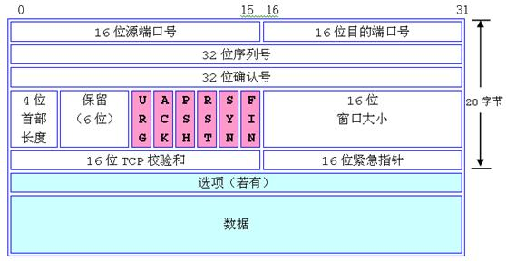
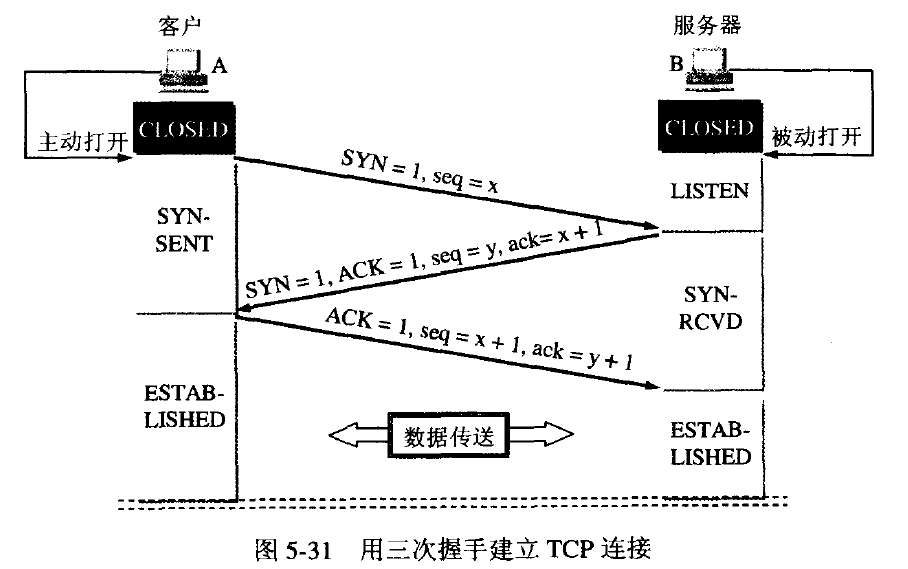

1.tcp 数据包格式

 
   - 序列号：用来标示从源端到目的端的发送的数据字节流，表示报文第一个数据字节的序号。序号到达2^32－1后又从0开始。
   刚开始开启一个连接时，SYN标志为1，顺序号为主机选择的该连接的初始顺序号。
   - 确认号：发送确认的一端希望收到的下一个顺序号，上次收到的顺序号+1，只有ACk为1时，字段有效
   - 首部：报头长度，指明数据从哪里开始的
   - 保留位：给将来使用，必须为0
   - 控制位：
      - ACK：为1时表示确认号有效，为0时表示报文不含确认信息
      - PSH：为1时表示紧急数据，指示接收方尽快将报文交给应用层，而不必等待缓冲区满
      - RST：用于复位由于主机崩溃，和其他原因出现的错误连接，
      - SYN：为1表示连接请求，用于建立连接和使顺序号同步
      - FIN：用于释放连接，为1表示发送方已经没有数据发送了，即关闭本方数据流。
   - 窗口大小：源方接受窗口大小，即从确认号开始，本报文源方可以接受字节数
   - 校验和：TCP头部和TCP数据，以 16 位字进行计算所得，发送方计算存储，接收方验证
   - 紧急指针：只有当URG置1时紧急指针有效，
   
2.TCP 三次握手

建立一个连接时，客户端和服务器总共发送3个包，同步连接双方序列号和确认号，并交互TCP窗口大小。

   - 服务器进程创建TCB，准备接受客户端进程连接请求，服务端进入LISTEN状态，等待客户端连接请求
   - A的tcp进程创建TCP，向B发送请求连接报文，SYN =1，选一个初始顺序号seq = x，SYN报文不能携带数据
   TCP客户端进入SYN-SEND 状态
   - B收到请求后如果同意建立连接则发送确认，SYN = ACK = 1, ack = x + 1, 选一个初始顺序号 seq=y。服务端进入SYN-RCVD
   - 客户端收到确认后，向服务端发送确认， ACK = 1， ack = y + 1, seq = x + 1, A 进入ESTABLISHED
   - 当B收到A的确认后，也进入ESTABLISHED阶段 。

3.SYN 攻击
   
服务器发送SYN-ACK后，收到客户端ACK之前的连接称为半连接，此时服务器处于Syn_RECV状态，
SYN攻击是客户端短时间内伪造大量不存在IP，向服务器不断发送SYN包，服务器发送确认，并等待客户端确认，
存在的，服务器需要不断的重发直至超时，这些伪造的SYN包将长时间占用未连接队列，正常的SYN请求被丢弃，

4.四次挥手

客户端和服务端均可发起挥手动作

   -  A 向B发送关闭连接报文，主动关闭连接，停止发送数据。FIN = 1， seq = u，上个报文seq + 1,A进入FIN_WAIT-1, 等待B确认
   -  B 收到A关闭连接报文，发出确认，ACK = 1， seq = v, 上个报文seq + 1, ack = u + 1, B 进入CLOSE_WAIT状态，
   从A到B连接已经释放，进入半关闭状态，A没有数据可发送，B发送数据A还可接受
   - A 收到B发送的确认报文后，进入FIN_WAIT-2， 等待B发送的释放连接报文
   - 如果B已经没有必要发送数据了，进程通知TCP释放连接，B发释放连接报文 FIN = 1，
   ACK = 1， seq = w (可能之前发送过报文)，ack = u + 1, 进入LAST-ACK
   - A 收到B发送的释放报文后，发确认报文，ACK = 1， seq = u + 1, ack = w + 1，进入TIME-WAIT,
   现在连接还没有释放，等待2MSL后，A进入CLOSED状态，MSL 最长报文寿命
   
5.为什么建立连接三次握手，关闭连接四次握手

   服务端收到客户端SYN报文时，把SYN和ACK方一个报文发送，SYN同步，ACK应答。但关闭连接时
   你收到对方发送的FIN，代表对方没有数据要发送，并不代表你不需要发送数据，ACK 和FIN分开发送
   
6.TIME_WAIT状态还需要等2MSL后才能返回到CLOSED状态？

   无法保证最后的ACK一定会被对方接受到，对方重发FIN报文，所以这个TIME_WAIT状态的作用就是用来重发可能丢失的 ACK报文。

7.注意
   - 一个TCP连接需要4个元祖标示：src_ip, src_port, dst_ip, dst_port
   - Sequence Number是包的序号，用来解决网络包乱序（reordering）问题
   - Acknowledgement Number就是ACK——用于确认收到，用来解决不丢包的问题。
   - Window又叫Advertised-Window，也就是著名的滑动窗口（Sliding Window），用于解决流控的。
   - TCP Flag，也就是包的类型，主要是用于操控TCP的状态机的。
   - 每一条TCP连接只能有两个端点。TCP只能进行点对点通信
   - TCP提供可靠交付的服务。通过TCP连接传输的数据，无差错、不丢失、不重复、并且按序到达
   
8.udp 

   - 长度：UDP报文的整个大小，最小为8个字节
   - 校验和：首部和数据一起校验
   
9.udp 特点
   
   - 是无连接的。
   - 是尽最大努力交付的。没有确认机制
   - 是面向报文的。也就是说UDP协议将应用层传输下来的数据封装在一个UDP包中，不进行拆分或合并。
   - 没有拥塞控制。发送速率不受网络阻塞的影响
   - UDP支持一对一、一对多、多对一和多对多的交互通信。
   
10. http状态码
   - 1XX  提示信息 - 表示请求已被成功接收，继续处理
   - 2XX  成功 - 表示请求已被成功接收，理解，接受
   - 3XX  重定向 - 要完成请求必须进行更进一步的处理
   - 4XX  客户端错误 -  请求有语法错误或请求无法实现
   - 5XX  服务器端错误 -   服务器未能实现合法的请求

11. HTTP 和 HTTPS区别
   - HTTPS使用端口443， HTTP使用端口80
   - HTTP提供身份验证与加密通信

12. 使用HTTPS与服务器通信流程

   - 浏览器发HTTPS请求
   - 服务器发送数字证书，有认证机构签名，公钥，有效时间，
   - 浏览器检测数字证书是否合适，并生成随机数，并用公钥加密，传给服务器。
   - 服务器用自己的私钥解密，得到随机字符串。
   

